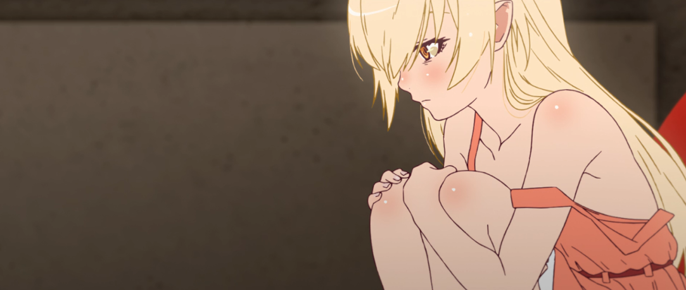

# Shinobu | 忍


<p align="center">
  
</p>


#### Current version: `0.6.0`

## What can this bot do?

Shinobu can do several things, answer your questions, ban/kick people, assign roles to people etc...

Here is a full list of what she does:

```xl
JavaScript version: "0.3.1"
Swift Version: "0.0.1"

COMMANDS ANYONE CAN USE:
.nick your nickname : "Changes your nickname on this server"
.role your role : "Assigns the mentioned role"
.8ball your question? : "Answers your weirdest questions"
.avatar : "Sends a direct link to your avatar"


COMMANDS FOR ADMINS/MODS ONLY:
.kick @member : "kicks the mentioned user"
.ban @member : "bans the mentioned user"
.purge ### : "Deletes up to 100 messages."

```


